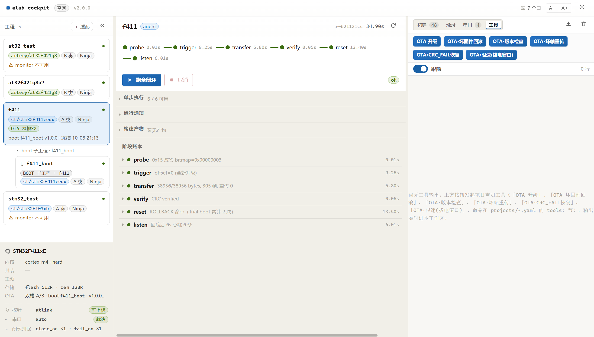
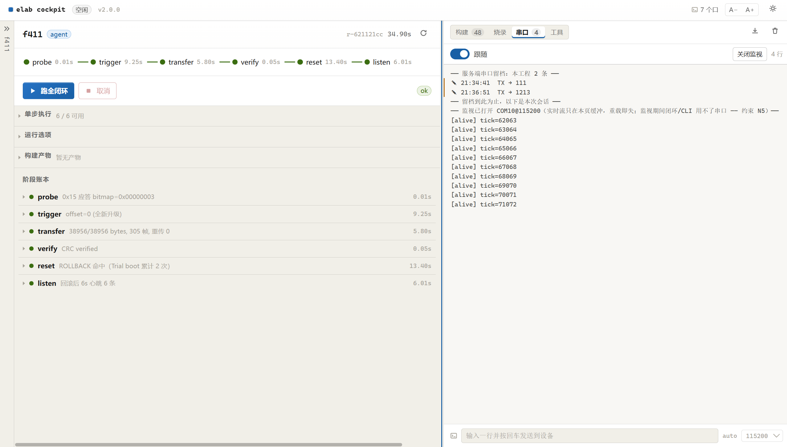

<div align="center">

# ELAB-Flow

**一套工具链 + 一套流程，驱动不同芯片的 编译 / 烧录 / 调试 / 串口闭环。**

业务工程源码**零改动** · Python **仅标准库** · 驾驶舱前端产物已入仓（运行时不需要 Node）

[](https://github.com/xkk6663/elab-flow/releases/latest)
[](https://github.com/xkk6663/elab-flow/actions/workflows/elab.yml)
[](tests/)
[](README.md#这是什么)
[](README.md#三十秒上手)
[](https://github.com/xkk6663/elab-flow/stargazers)

[快速上手](#quickstart) · [主要功能](#features) · [驾驶舱使用](#cockpit) · [实测证据](#evidence) · [接入新芯片](#addchip) · [文档索引](#docs) · [CHANGELOG](CHANGELOG.md)



*闭环驾驶舱（L7）：工程卡与芯片卡 → 阶段状态带（内存占位 / 产物 / 零改动守卫）→ 实时日志证据轨*

</div>

---

<a id="这是什么"></a>

## 这是什么

嵌入式项目常见的困境：**每换一颗芯片，就要重搭一遍工程、重配一遍工具链、重写一遍构建脚本**。
CubeMX 一套、WorkBench 一套、Keil/IAR 又各一套 —— 工具链版本靠 PATH 运气，烧录参数散落在 IDE 里，
真机验证全靠手工。

**ELAB-Flow 做的不是"一套代码跑不同平台"，而是"一套工具链和流程跑不同芯片"。**

| ELAB-Flow 做 | ELAB-Flow **不**做 |
|---|---|
| ✅ 同一句 `elab build -p X` 编译不同厂商、不同内核的芯片 | ❌ 代码级可移植层 / 运行时平台抽象 |
| ✅ 业务代码原地不动，一个字不改（文件树快照可断言） | ❌ 搬代码、重组目录、建 `apps/` `framework/` |
| ✅ 一份通用 `gcc.cmake`，差异只由芯片 YAML 驱动 | ❌ 每颗芯片各写一份工具链文件 |

> **外骨骼原则**：业务代码是器官，elab 是外骨骼。外骨骼不改器官，只负责把器官接上流水线 ——
> 且每次构建前后做文件树快照，`guard.untouched == true` 是可断言的结果，不是承诺。

<a id="quickstart"></a>

## 三十秒上手

```bash
git clone git@github.com:xkk6663/elab-flow.git
cd elab-flow

./elab doctor              # ① 环境体检（先全绿再往下）
./elab loop -p at32_test   # ② 一键闭环：体检→编译→烧录→断到 main 自检→串口判据
python -m cockpit.server   # ③ 闭环驾驶舱 → http://127.0.0.1:3333/
```

- 要求：**Python ≥ 3.8（无第三方依赖）**；可选 CMake + Ninja + ARM GCC + OpenOCD（上板闭环用）
- Windows：`elab.cmd` / Git Bash 用 `./elab`；桌面场景直接**双击 `cockpit.cmd`**
  （幂等：已在跑只开 UI；UI 走 Edge `--app` 独立窗口）
- 没有探针时 `doctor` / `build` / `ci` 照样可跑（`loop` 会在 flash 步失败）

**接入你自己的工程（三种方式，同一份实现）**：驾驶舱「＋ 适配」一键探测→写入；
或 CLI `./elab adapt <path> --write && ./elab adapt <path> --verify`；
或照 `projects/at32_test.yaml` 手写一份。人工接管的文件**绝不覆盖**（A7 保护）。

<a id="cockpit"></a>

## 驾驶舱使用（五分钟）

| 步骤 | 操作 | 你会看到 |
|---|---|---|
| ① 启动 | 双击 `cockpit.cmd`（或 `python -m cockpit.server`） | 独立窗口（Edge `--app`）；已在跑则只开 UI，幂等 |
| ② 接入工程 | 工程轨「＋ 适配」→ 粘贴工程根目录**绝对路径** → 「探测」→「写入」 | 只读探测报告（T1/T3、置信度、芯片、证据链）→ 写入后新卡片**自动出现并选中** |
| ③ 跑闭环 | 选中卡片 → 「▶ 跑全闭环」 | 阶段带逐步点亮；不可用步骤（如没接板）**自动排除**；日志实时滚进证据轨 |
| ④ 只跑一步 | 阶段轨一排六颗单步按钮；证据轨各 Tab 内有对应按钮 | 置灰的按钮 tooltip 直接说明原因（如"monitor 不可用：固件无心跳判据"） |
| ⑤ 看懂阶段轨 | — | **内存占位**取自 `.map`（增量构建也准）；**产物** elf/hex/bin/map 可点击；**零改动守卫**显示"未触碰 N 文件" |
| ⑥ 串口监视 | 串口 Tab → 「打开监视」 | 设备输出实时流入（600ms 增量轮询，丢行显式报告）；「关闭监视」一键释放 |
| ⑦ 串口手写 | 底部输入框敲一行回车 | `TX → …` / `← 回显`；落独立留档（重启页面自动回填最近 60 条）；与闭环**双向 409 互斥** |
| ⑧ 预览 | 阶段轨「预览」 | 只读打印将执行的每条命令（`--clean` 的删目录副作用显式标红），不 spawn、不写盘 |



*串口 Tab：「打开监视」常驻实时流；输入框手写通道（TX/RX 独立留档，进工程自动回填最近 60 条）*

> 提示：监视是"看"，不是"证据"——它只活环形缓冲；要可复核的判定走闭环 `monitor` 步骤。


<a id="features"></a>

## 主要功能

<table>
  <tr>
    <td width="50%" valign="top">
      <h3>五步闭环 CLI</h3>
      <p><code>elab loop</code>：doctor → build → flash → debug --verify → monitor，一条命令走完。
      每一步都有可 grep 的证据行（<code>Verified OK</code> / 断点 PC / 串口命中），拒绝"看起来像成功了"。</p>
    </td>
    <td width="50%" valign="top">
      <h3>确定性一键适配</h3>
      <p><code>elab adapt</code> 扫描 CubeMX / WorkBench 导出的工程 → 生成接入 YAML（带 provenance 证据链）。
      探测→写入两段式，未决项不猜；驾驶舱里有同源 UI 入口，写入后卡片自动出现。</p>
    </td>
  </tr>
  <tr>
    <td width="50%" valign="top">
      <h3>闭环驾驶舱（L7）</h3>
      <p>三列布局：工程轨 → 阶段轨 → 证据轨。实时日志、内存占位（取自 .map）、零改动守卫、
      单步独立按钮、只读命令预览。零第三方依赖：stdlib HTTP + SSE 手写，前端产物已入仓。</p>
    </td>
    <td width="50%" valign="top">
      <h3>串口闭环 + 常驻监视</h3>
      <p>判据引擎（close_on / fail_on / 静默超时 → ok / failed / inconclusive）+ 手写通道 +
      常驻监视（读线程异常自愈、环形缓冲增量拉取）。与闭环双向 409 互斥，指名道姓不猜。</p>
    </td>
  </tr>
  <tr>
    <td width="50%" valign="top">
      <h3>CI 本地云端同源</h3>
      <p>本地 <code>elab ci</code> 与 GitHub Actions 共用同一份 <code>ci/matrix.yaml</code>。
      产物路径由 CI 报告自报——接入新工程无需改 workflow；门禁绿却零产物 → 红。</p>
    </td>
    <td width="50%" valign="top">
      <h3>每芯片 AI Skill</h3>
      <p><code>elab skill</code> 从 <code>chips/*.yaml</code> 渲染 per-chip SKILL.md：
      芯片身份表 + 闭环命令 + 坑位 + 验收清单。AI 读的提示与 doctor 校验的参数来自同一份 YAML，不会悄悄过期。</p>
    </td>
  </tr>
</table>

**工具链透明**——elab 不发明工具链，每条子命令落到底都是你认识的公开命令（`--dry-run` 原样打印）：

| elab 子命令 | 底层工具链 | 做什么 |
|---|---|---|
| `elab build` | **CMake** → **Ninja** → **arm-none-eabi-gcc** | 统一产出 `elf / hex / bin / map` |
| `elab flash` | **OpenOCD**（CMSIS-DAP / ST-Link / J-Link） | 单镜像 `program … verify reset exit`；声明 `flash.images` 后自动切**OTA 双镜像序列**（Boot elf + App bin@显式地址，一次会话 `reset run` 收尾，约束 C33） |
| `elab debug` | **OpenOCD**（GDB server）+ **arm-none-eabi-gdb** | 断到 `main` 自检 / 交互调试（镜像模式自动跳过 `load`） |
| `elab monitor` | **pyserial / ctypes**（零依赖降级） | 串口闭环判据三态 |

```text
# 跨芯片时整条链只换一个参数（target cfg），其余一字不改：
AT32 :  -f interface/atlink.cfg  -f target/at32f421xx.cfg
STM32:  -f interface/atlink.cfg  -f target/stm32f1x.cfg      ← 只换 target
```

<a id="evidence"></a>

## 实测证据

四个真实工程（两类图形配置器形态），同一份工具链：

| | AT32_TEST | STM32_TEST | at32f421g8u7 ★ | at32f421g8u7_workbench |
|---|---|---|---|---|
| 工程形态 | B 类（WorkBench） | A 类（CubeMX） | B 类（`elab adapt` 自动接入） | B 类 + **OTA 双镜像**（Boot 18K + APP 44K） |
| 编译 | ✅ FLASH 7.39% | ✅ FLASH 57.65% | ✅ FLASH 17.99% | ✅ APP bin 37.5KB · guard 592 文件零改动 |
| 零改动守卫 | ✅ 153 文件 | ✅ 1145 文件 | ✅ 99 文件 | ✅ 592 文件 |
| 烧录 / 调试 | ✅ `Verified OK` · 断到 `main.c:78` | ⚠️ 未上板（无板） | ✅ `Verified OK` · 断到 `main.c:103` | ✅ 双镜像预览实测（Boot@0x08000000 / App@0x08004800）；上板待验 |
| 串口闭环 | — | — | ✅ 2.6s 命中 `[alive]`，事件链全达浏览器 | 判据就绪（`heartbeat tick=` / `*** CRASH ***`），待板 |

```text
$ ./elab loop -p at32_test --clean
[1/4] doctor   ✓ 全绿
[2/4] build    ✓ FLASH 4840/65536 B (7.39%)  RAM 1576/16384 B (9.62%)  guard ✓ untouched=True
[3/4] flash    ✓ ** Programming Finished ** → ** Verified OK **
[4/4] debug    ✓ Breakpoint 1, main () at .../main.c:78
[elab] ✓✓ 闭环完成
```

- **云端**：GitHub Actions `ubuntu-latest` 三工程 `doctor --deep` + `build` 全绿（`host-gate`），
  前端产物 `web-dist-guard` 可复现零差异
- **质量门**：单元 151/151 + 集成 37/37（真起服务、真编译）+ 判据引擎 38 例离线单测

<a id="addchip"></a>

## 接入一颗新芯片 = 3 步

```bash
# ① 写芯片参数（唯一的"跨芯片差异"所在）
$EDITOR chips/<vendor>/<id>.yaml     # cpu/fpu/memory/openocd_target/verify(expect_*)/pitfalls

# ② 写项目接入（指向业务工程的只读指针）
$EDITOR projects/<name>.yaml         # root / chip / archetype / toolchain_file / linker_script

# ③ 跑起来
./elab doctor -p <name> --deep       # 两源对账
./elab loop   -p <name>              # 闭环
./elab skill  -p <name>              # 生成该芯片 AI skill
```

不需要改 `services/` 下任何代码，也不需要新增 CMake 文件。

<a id="constraints"></a>

## 设计约束（踩过的坑，全部已固化为代码）

完整 **C1–C32** 见 **[docs/设计约束.md](docs/设计约束.md)**——每条都附"为什么"与真实事故。精选：

| # | 一句话 |
|---|---|
| C17 | 事件流**单写者**：只有 `elab run --emit-events` 写，其余一律不碰 |
| C22/C23 | CI 不写死产物路径；门禁绿却零产物 → 红 |
| C24–C26 | SSE 合并只认进程输出；背压丢弃留痕；控制帧绝不丢 |
| C28/C31 | 手写留档、常驻监视输出都**不进事件流**（两条道互不污染） |
| C29/C30 | 适配写入后热重载 Config；「跑全闭环」必须显式传步序 |
| C32 | stdout 重定向 + GBK 区域编码会崩服务 —— 包入口统一守卫 |

<a id="docs"></a>

## 文档索引

| 目标 | 入口 |
|---|---|
| 版本发布说明（功能总览 / 验收 / 已知限制） | [CHANGELOG.md](CHANGELOG.md) |
| **设计约束 C1–C32**（本仓库的"为什么"） | [docs/设计约束.md](docs/设计约束.md) |
| 事件契约 ICD（topic 全集 / SSE 帧格式 / 兼容承诺） | [docs/ICD_cockpit_events.md](docs/ICD_cockpit_events.md) |
| 驾驶舱方案与实现记录（决策 D / 约束 N / 串口判据） | [docs/技术方案_闭环驾驶舱.md](docs/技术方案_闭环驾驶舱.md) |
| 跨平台 CI 工作流架构设计 | [docs/ELAB_跨平台CI工作流架构设计.md](docs/ELAB_跨平台CI工作流架构设计.md) |
| 与 ELAB 框架的横向对比 | [docs/架构对比_ELAB_vs_elab-Flow.md](docs/架构对比_ELAB_vs_elab-Flow.md) |
| 干跑验证报告（AT32 / STM32 / CLI / 上板闭环） | [docs/](docs/) 四篇，约束 C1–C16 的出处 |

## 已知限制（不计入完成）

- STM32 **上板**烧录/调试未验证（本机只有 AT32 板；命令已生成）
- `onhw-gate` 需 self-hosted 探针（云端编译门禁不受影响）
- 驾驶舱 `profiles/*.yaml` 插件化装配（M4）、`elab skill --adapt`（M5.5）未实现
- 常驻监视的实时流只活环形缓冲（重启即失）—— 它是"看"，要证据走闭环 `monitor`

## 设计边界

- **对象是"工作链"，不是"代码"**：configure / build / flash / debug / monitor / CI / AI / 事件流
- **三个收敛点**：主机路径 → `elab.host.yaml`；芯片差异 → `chips/*.yaml`；工程接入 → `projects/*.yaml`
- **两个技术支点**：`-DCMAKE_TOOLCHAIN_FILE` + `-DCMAKE_PROJECT_INCLUDE`（不改源码接管）；
  `openocd + gdb` CLI（不依赖任何 IDE 插件）
- **验收标准**：同一句 `elab build/flash -p X` 对不同厂商、不同内核的工程同样成立，
  且业务工程文件树恒为 `untouched`
